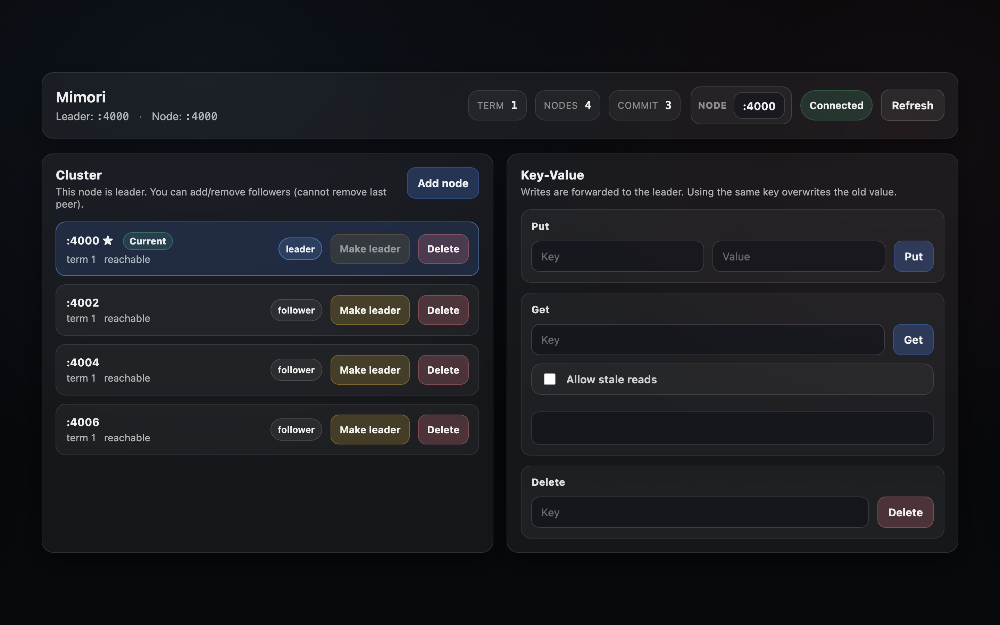
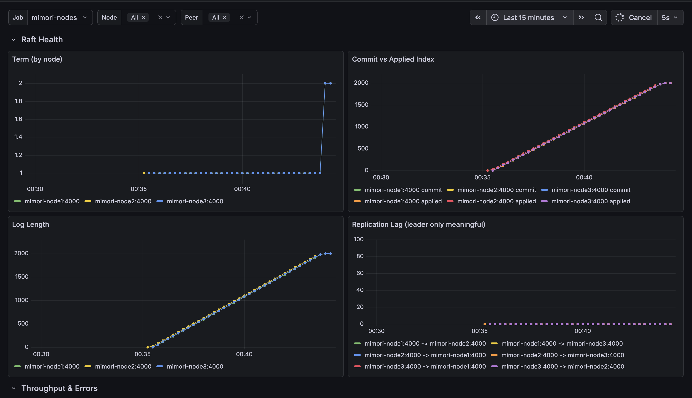
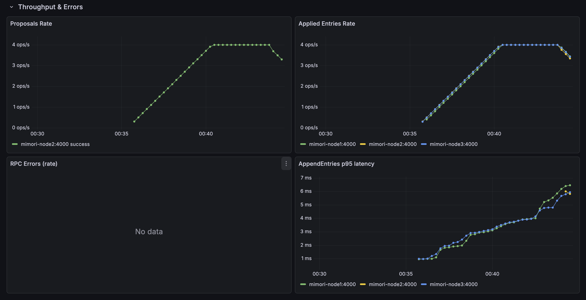

# Mimori

> A distributed key-value store built on Raft consensus

Mimori is a distributed key-value store built in Go implementing the Raft consensus algorithm. It provides strong consistency for writes, optional follower reads for scalability, dynamic cluster membership, and a rich set of interfaces including a Go client library, CLI tool, web dashboard, and REST API.

---

## Table of Contents

- [Features](#features)
- [Quick Start](#quick-start)
- [Using the Go Client Library](#using-the-go-client-library)
- [Advanced Usage](#advanced-usage)
- [Architecture](#architecture)
- [Interfaces](#interfaces)
  - [Go Client Library](#go-client-library)
  - [CLI Tool (mimorictl)](#cli-tool-mimorictl)
  - [Web Dashboard](#web-dashboard)
  - [HTTP/REST API](#httprest-api)
- [Building from Source](#building-from-source)
- [Running Manually](#running-manually)
- [Configuration](#configuration)
- [Observability](#observability)
- [Development](#development)
- [Troubleshooting](#troubleshooting)
- [Documentation](#documentation)
- [License](#license)

---

## Features

### Core Capabilities

- **Raft Consensus**: Leader election, log replication, snapshotting
- **Strong Consistency**: Writes (`Put`/`Delete`) committed through Raft leader
- **Follower Reads**: Optional stale reads from followers with read leases (bounded staleness)
- **Persistent Storage**: Pebble-backed KV state machine
- **Dynamic Membership**: Add/remove nodes at runtime
- **Leader Transfer**: Graceful leadership handoff for maintenance
- **gRPC Interface**: High-performance RPC for all cluster operations

### Interfaces

- **Go Client Library**: Full-featured package for embedding in applications
- **CLI Tool** (`mimorictl`): Command-line administration with leader discovery and auto-retry
- **Web Dashboard**: Embedded UI for cluster management and KV operations
- **REST API**: Full HTTP/JSON API for programmatic access
- **gRPC API**: Direct gRPC access for custom clients

### Operations

- **Health Checks**: `/healthz`, `/ready` endpoints
- **Metrics**: Prometheus-compatible `/metrics` endpoint
- **Observability**: Docker Compose setup with Prometheus + Grafana

---

## Quick Start

Get Mimori up and running quickly. Start by cloning the repo, then choose either the quick single-node demo or the full Docker Compose stack.

### Step 1: Clone the Repository

```bash
git clone https://github.com/jerkeyray/mimori.git
cd mimori
```

### Option A: Quick Web Dashboard (Single Node, No Docker)

If you just want to try the web UI and a single-node Mimori instance:

```bash
bash scripts/dashboard-start.sh
```

Then open the dashboard at:

- http://localhost:4001

From there, you can explore the cluster view, put/get/delete keys, and experiment with adding more nodes from the dashboard once you have additional `mimorid` processes running.

#### Dashboard Preview



When you're done, stop it with:

```bash
bash scripts/dashboard-stop.sh
```

### Option B: Full Stack (3-node Cluster + Prometheus + Grafana)

#### Step 2: Start the Cluster

Start a 3-node cluster with Prometheus and Grafana monitoring:

```bash
docker-compose up -d
```

Wait a few seconds for the cluster to initialize. Check that all services are running:

```bash
docker-compose ps
```

#### Step 3: Install the CLI Tool

```bash
make install
```

This installs `mimorictl` to `$GOPATH/bin`. Make sure it's in your PATH:

```bash
export PATH="$(go env GOPATH)/bin:$PATH"
```

Verify installation:

```bash
mimorictl --help
```

#### Step 4: Use the CLI

Now you can interact with your cluster:

```bash
# Check cluster status
mimorictl status

# Store a key-value pair
mimorictl put hello world

# Retrieve it
mimorictl get hello

# Delete it
mimorictl del hello
```

The CLI automatically discovers the leader, handles retries, and maps Docker internal hostnames to localhost ports (so it works seamlessly when running outside Docker containers).

**More CLI commands:**

```bash
# Cluster operations
mimorictl health         # Check if nodes are alive
mimorictl leader         # Show current leader
mimorictl metrics        # Show Prometheus metrics

# Follower reads (optional stale reads for scalability)
mimorictl get mykey --allow-stale

# Admin operations
mimorictl add-node :4006              # Add a node
mimorictl remove-node :4006           # Remove a node
mimorictl transfer-leadership :4002   # Transfer leadership
mimorictl snapshot                    # Force snapshot
```

**Short aliases:**

- `mimorictl p key value` → put
- `mimorictl g key` → get
- `mimorictl d key` → delete

### Step 5: Explore the Web Dashboard

Open your browser and visit the web dashboard:

**http://localhost:4001**

The dashboard lets you:

- View cluster status and topology
- See which node is the leader
- Put/get/delete keys via the UI
- Monitor node health
- Manage cluster membership

You can access any node's dashboard:

- **Node 1**: http://localhost:4001
- **Node 2**: http://localhost:4003
- **Node 3**: http://localhost:4005

### Step 6: View Metrics (Optional)

Check out the monitoring stack:

- **Prometheus**: http://localhost:9090
- **Grafana**: http://localhost:3000 (login: admin/admin)

#### Grafana Dashboard Preview



In Grafana, open **Dashboards → Browse → "Mimori Raft Cluster"**.

Grafana includes pre-configured dashboards showing:

- Request rates and latencies
- Raft state (leader/follower/term)
- Storage metrics
- Cluster health

---

### What You Have Now

A fully functional distributed key-value store with:

- 3-node Raft cluster running locally
- CLI tool for command-line operations
- Web dashboard for visual management
- Prometheus + Grafana for monitoring
- Automatic leader election and failover

### Try It Out

Test the cluster's fault tolerance:

```bash
# Kill the leader
docker-compose stop node1

# Watch a new leader get elected
mimorictl status

# Data is still accessible
mimorictl get hello
```

### Stop the Cluster

When you're done:

```bash
docker-compose down
```

---

## Using the Go Client Library

Install the client library in your Go project:

```bash
go get github.com/jerkeyray/mimori
```

**Simple Example:**

```go
package main

import (
    "context"
    "fmt"
    "log"

    "github.com/jerkeyray/mimori/client"
)

func main() {
    // Create client with seed addresses
    c, err := client.New([]string{"localhost:4000", "localhost:4002", "localhost:4004"})
    if err != nil {
        log.Fatal(err)
    }
    defer c.Close()

    ctx := context.Background()

    // Put a key-value pair
    if err := c.Put(ctx, []byte("hello"), []byte("world")); err != nil {
        log.Fatal(err)
    }

    // Get with strong consistency (reads from leader)
    value, found, err := c.Get(ctx, []byte("hello"))
    if err != nil {
        log.Fatal(err)
    }
    if found {
        fmt.Printf("Value: %s\n", value)
    }

    // Delete
    if err := c.Delete(ctx, []byte("hello")); err != nil {
        log.Fatal(err)
    }
}
```

**Run the example:**

```bash
# With Docker Compose running
cd examples/simple
go run main.go
```

See [examples/simple/](examples/simple/) for a comprehensive example with stale reads, timeouts, and error handling.

---

## Advanced Usage

### CLI Only Installation

If you already have a Mimori cluster running elsewhere and just need the CLI tool:

```bash
go install github.com/jerkeyray/mimori/cmd/mimorictl@latest

# Point to your cluster
mimorictl --addr your-cluster-host:4000 status
```

---

## Architecture

### High-Level Overview

```text
┌─────────────┐
│   Clients   │
│  CLI / UI   │
│  Go Client  │
└──────┬──────┘
       │ gRPC (KV + Raft admin) / HTTP (REST API)
       ▼
┌─────────────┐     ┌─────────────┐     ┌─────────────┐
│   Node 1    │◄───►│   Node 2    │◄───►│   Node 3    │
│  (Leader)   │     │  (Follower) │     │  (Follower) │
│             │     │             │     │             │
│ gRPC :4000  │     │ gRPC :4002  │     │ gRPC :4004  │
│ HTTP :4001  │     │ HTTP :4003  │     │ HTTP :4005  │
└──────┬──────┘     └──────┬──────┘     └──────┬──────┘
       │                    │                    │
       │  Raft Log          │  Raft Log          │  Raft Log
       │  Replication       │  Replication       │  Replication
       ▼                    ▼                    ▼
┌─────────────┐       ┌─────────────┐       ┌─────────────┐
│  Pebble KV  │       │  Pebble KV  │       │  Pebble KV  │
│  (Storage)  │       │  (Storage)  │       │  (Storage)  │
└─────────────┘       └─────────────┘       └─────────────┘
```

### Node Internals

Each Mimori node consists of:

1. **Raft Core** (`internal/raft/`)

   - Leader election and heartbeats
   - Log replication
   - Snapshotting and compaction
   - Dynamic membership (config changes)
   - Leader transfer
   - Read lease management for follower reads

2. **State Machine** (`internal/storage/`)

   - Pebble-backed KV store
   - Apply loop processes committed log entries
   - Atomic operations

3. **gRPC Server** (`internal/api/`)

   - KV service: `Put`, `Get`, `Delete`, `Health`
   - Raft admin service: cluster membership, leader transfer

4. **HTTP Server** (port = gRPC port + 1)
   - Health/readiness: `/healthz`, `/ready`
   - Raft status: `/raft/status`
   - Metrics: `/metrics` (Prometheus format)
   - REST API: `/api/kv/*`, `/api/cluster/*`
   - Web dashboard: `/` (redirects to `/dashboard/`)

### Consistency Model

**Writes** (`Put`, `Delete`):

- Must go through the Raft leader
- Linearizable (strong consistency)
- Followers return `leader=<addr>` hint for clients to follow

**Reads** (`Get`):

- **Default**: Leader reads (linearizable)
- **Optional**: Follower reads with `--allow-stale` or `AllowStale: true`
  - Requires valid read lease (follower received heartbeat recently)
  - Bounded staleness (~300ms max)
  - Higher throughput, lower latency

See [docs/FOLLOWER_READS.md](docs/FOLLOWER_READS.md) for detailed explanation.

---

## Interfaces

### Go Client Library

**Package:** `github.com/jerkeyray/mimori/client`

Feature-complete client with:

- Automatic leader discovery and caching
- Connection pooling and reuse
- Automatic retries with exponential backoff
- Context support for timeouts/cancellation
- Thread-safe (safe for concurrent goroutines)

**Installation:**

```bash
go get github.com/jerkeyray/mimori
```

**API:**

```go
// Create client
c, err := client.New([]string{"host1:4000", "host2:4000"})
defer c.Close()

// Put (always goes to leader)
err = c.Put(ctx, []byte("key"), []byte("value"))

// Get (strong read from leader)
value, found, err := c.Get(ctx, []byte("key"))

// Get with stale reads (from followers)
value, found, err = c.GetWithOptions(ctx, []byte("key"), client.GetOptions{
    AllowStale: true,
})

// Delete
err = c.Delete(ctx, []byte("key"))

// Health check
err = c.Health(ctx)
```

**Custom Configuration:**

```go
cfg := client.Config{
    Seeds:       []string{"localhost:4000"},
    ConnTimeout: 5 * time.Second,   // Connection timeout
    ReqTimeout:  10 * time.Second,  // Request timeout
    MaxRetries:  5,                 // Retry attempts
}
c, err := client.NewWithConfig(cfg)
```

**Documentation:**

- Package docs: [client/](client/)
- Examples: [examples/simple/](examples/simple/)
- API reference: [client/README.md](client/README.md)

### CLI Tool (mimorictl)

Command-line interface for manual operations and scripting.

**Features:**

- Automatic leader discovery via seed addresses
- Connection pooling and retry logic
- Short command aliases
- Environment variable support

**Commands:**

| Command                    | Alias  | Description             |
| -------------------------- | ------ | ----------------------- |
| `put <key> <value>`        | `p`    | Store key-value pair    |
| `get <key>`                | `g`    | Retrieve value          |
| `get <key> --allow-stale`  |        | Read from followers     |
| `del <key>`                | `d`    | Delete key              |
| `health`                   | `h`    | Health check            |
| `status`                   | `st`   | Cluster status          |
| `leader`                   | `ldr`  | Show current leader     |
| `metrics`                  | `m`    | Prometheus metrics      |
| `snapshot`                 | `snap` | Force snapshot (leader) |
| `add-node <id>`            | `add`  | Add cluster member      |
| `remove-node <id>`         | `rm`   | Remove cluster member   |
| `transfer-leadership <id>` | `tl`   | Transfer leadership     |

**Environment Variables:**

- `MIMORI_ADDRS` or `MIMORI_SEEDS`: Comma-separated seed addresses (e.g., `127.0.0.1:4000,127.0.0.1:4002`)

### Web Dashboard

Each node serves an embedded web UI at `http://<node-http-port>/`

**Features:**

- Real-time cluster status
- KV browser and editor
- Leader/follower indication
- Node health monitoring
- Cluster membership management
- Leader transfer UI

**Access:**

- Node 1: `http://localhost:4001`
- Node 2: `http://localhost:4003`
- Node 3: `http://localhost:4005`

### HTTP/REST API

Full REST API available on each node's HTTP port.

#### Ops Endpoints

- `GET /healthz` - Health check
- `GET /ready` - Readiness check
- `GET /raft/status` - Raft state (JSON)
- `POST /raft/snapshot` - Force snapshot (leader only)
- `GET /metrics` - Prometheus metrics

#### KV Endpoints

- `GET /api/kv/{key}` - Get value
- `GET /api/kv/{key}?allow_stale=true` - Stale read
- `PUT /api/kv/{key}` - Put value (body: `{"value": "..."}`)
- `DELETE /api/kv/{key}` - Delete key

#### Cluster Endpoints

- `GET /api/cluster/nodes` - List cluster members
- `GET /api/cluster/status` - Cluster status
- `POST /api/cluster/add-node` - Add node
- `POST /api/cluster/remove-node` - Remove node
- `POST /api/cluster/transfer-leadership` - Transfer leadership

---

## Building from Source

### Prerequisites

- Go 1.23 or later
- Docker (optional, for Docker Compose setup)
- Make (optional, for convenience)

### Clone and Build

```bash
# Clone repository
git clone https://github.com/jerkeyray/mimori.git
cd mimori

# Build binaries
make build

# Or build manually
go build -o bin/mimorid ./cmd/mimorid
go build -o bin/mimorictl ./cmd/mimorictl

# Install to $GOPATH/bin
make install
```

### Make Targets

```bash
make build          # Build binaries to ./bin/
make install        # Install to $GOPATH/bin
make clean          # Remove build artifacts
make test           # Run all tests
make test-e2e       # Run integration tests
make test-chaos     # Run chaos tests
make test-load      # Run load tests
make fmt            # Format code
make vet            # Run go vet
make lint           # Format + vet
make docker-build   # Build Docker image
make docker-up      # Start cluster
make docker-down    # Stop cluster
make docker-logs    # View logs
make help           # Show all targets
```

---

## Running Manually

### Single Node (Development)

```bash
# Start a single node
bash scripts/dashboard-start.sh

# Dashboard will be at http://localhost:4001
```

Stop with:

```bash
bash scripts/dashboard-stop.sh
```

### Multi-Node Cluster (Manual)

**Node 1 (Initial Leader):**

```bash
MIMORI_ADDR=:4000 \
MIMORI_NODE_ID=:4000 \
MIMORI_PEERS="" \
MIMORI_DATA=./data1 \
./bin/mimorid
```

**Node 2:**

```bash
MIMORI_ADDR=:4002 \
MIMORI_NODE_ID=:4002 \
MIMORI_PEERS=":4000" \
MIMORI_DATA=./data2 \
./bin/mimorid
```

**Node 3:**

```bash
MIMORI_ADDR=:4004 \
MIMORI_NODE_ID=:4004 \
MIMORI_PEERS=":4000" \
MIMORI_DATA=./data3 \
./bin/mimorid
```

Note: HTTP server automatically binds to gRPC port + 1 (e.g., `:4001` for gRPC `:4000`)

---

## Configuration

### Server Environment Variables

| Variable            | Default       | Description                                 |
| ------------------- | ------------- | ------------------------------------------- |
| `MIMORI_ADDR`       | `:4000`       | gRPC listen address                         |
| `MIMORI_HTTP_ADDR`  | (gRPC+1)      | HTTP listen address                         |
| `MIMORI_DATA`       | `data`        | Data directory for Pebble storage           |
| `MIMORI_PEERS`      | `""`          | Comma-separated initial peers               |
| `MIMORI_NODE_ID`    | (MIMORI_ADDR) | Raft node ID                                |
| `MIMORI_LOG_FORMAT` | `console`     | Log format: `json` or `console`             |
| `MIMORI_LOG_LEVEL`  | `info`        | Log level: `debug`, `info`, `warn`, `error` |

### Client Environment Variables

| Variable       | Description                                   |
| -------------- | --------------------------------------------- |
| `MIMORI_ADDRS` | Comma-separated seed addresses for CLI/client |
| `MIMORI_SEEDS` | Alias for `MIMORI_ADDRS`                      |

---

## Observability

### Metrics

Prometheus-compatible metrics available at `/metrics` on each node's HTTP port.

**Key Metrics (as exposed by the server and used in Grafana):**

- `raft_node_is_leader` - Whether this node is the leader (1) or not (0)
- `raft_term` - Current Raft term
- `raft_commit_index` - Highest committed log index
- `raft_proposals_total` - Total number of proposals (labeled by status)
- `raft_replication_lag` - Replication lag per follower
- `raft_rpc_errors_total` - Total RPC errors (labeled by rpc_type and error_type)

### Monitoring Stack

Docker Compose includes:

- **Prometheus**: `http://localhost:9090`
- **Grafana**: `http://localhost:3000` (admin/admin)

#### Grafana Dashboard Preview




In Grafana, open **Dashboards → Browse → "Mimori Raft Cluster"**.

Pre-configured dashboard shows:

- Cluster topology
- Request rates and latencies
- Raft state transitions
- Storage metrics

See [docker/README.md](docker/README.md) for details.

---

## Development

### Running Tests

```bash
# All tests
make test

# Specific test suites
make test-e2e         # Integration tests
make test-chaos       # Chaos/failure tests
make test-load        # Load tests
make test-stress      # Stress tests

# With coverage
go test -cover ./...

# Verbose
go test -v ./...
```

See [docs/TESTING.md](docs/TESTING.md) for comprehensive testing guide.

### Repository Structure

```text
mimori/
├── cmd/                      # Binaries
│   ├── mimorid/             # Server binary
│   └── mimorictl/           # CLI binary
├── client/                   # Go client library (public API)
│   ├── client.go
│   ├── client_test.go
│   ├── example_test.go
│   ├── doc.go
│   └── README.md
├── examples/                 # Example applications
│   └── simple/              # Simple client example
├── internal/                 # Private packages
│   ├── api/                 # gRPC + HTTP servers
│   │   ├── kv/             # KV service
│   │   └── web/            # Dashboard + REST API
│   ├── raft/                # Raft implementation
│   ├── storage/             # Pebble wrapper
│   ├── cluster/             # Peer management
│   ├── logging/             # Structured logging
│   └── utils/               # Utilities
├── tests/                    # Integration tests
│   ├── e2e_test.go
│   ├── chaos_test.go
│   └── load_test.go
├── docs/                     # Documentation
│   ├── FOLLOWER_READS.md
│   └── TESTING.md
├── docker/                   # Docker configs
│   ├── prometheus.yml
│   └── grafana/
├── scripts/                  # Helper scripts
│   ├── dashboard-start.sh
│   └── tests/               # Shell test scripts
├── proto/                    # Protobuf definitions
│   ├── kv.proto
│   └── raft.proto
├── docker-compose.yml
├── Dockerfile
├── Makefile
├── LICENSE
└── README.md                 # This file
```

## Troubleshooting

### Common Issues

**"not leader, leader=..."**

- You sent a write request to a follower
- Solution: Use seed addresses (`--addr a,b,c` or `MIMORI_ADDRS`) so CLI can discover leader
- The client library handles this automatically

**"operation failed after 3 retries"**

- Cluster might not be running
- Solution: Start cluster with `docker-compose up -d`
- Wait a few seconds for leader election

**"follower reads rejected"**

- Follower doesn't have a valid read lease
- Solution: Ensure follower is receiving heartbeats
- Check cluster health: `mimorictl status`

**Dashboard not loading**

- Check HTTP port (gRPC port + 1)
- Node 1: `http://localhost:4001` (not 4000)
- Try: `curl http://localhost:4001/healthz`

**"could not discover leader from any seed"**

- Cluster isn't running or seeds are wrong
- Solution: Verify cluster with `docker-compose ps`
- Check addresses in `MIMORI_ADDRS`

---

## Documentation

### Core Docs

- [Follower Reads Explanation](docs/FOLLOWER_READS.md)
- [Testing Guide](docs/TESTING.md)
- [Docker Setup](docker/README.md)

### API Documentation

- [Client Library API](client/README.md)
- [Client Examples](examples/simple/)

### Additional Resources

- Raft Paper: https://raft.github.io/raft.pdf
- Pebble Storage: https://github.com/cockroachdb/pebble

---

## License

MIT License - see [LICENSE](LICENSE) file for details.

---

## Acknowledgments

- Raft consensus algorithm by Diego Ongaro and John Ousterhout
- Built with [Pebble](https://github.com/cockroachdb/pebble) storage engine
- Inspired by [etcd](https://etcd.io/) and [Consul](https://www.consul.io/)

---

**Mimori** - Reliable distributed storage, simple to use.
